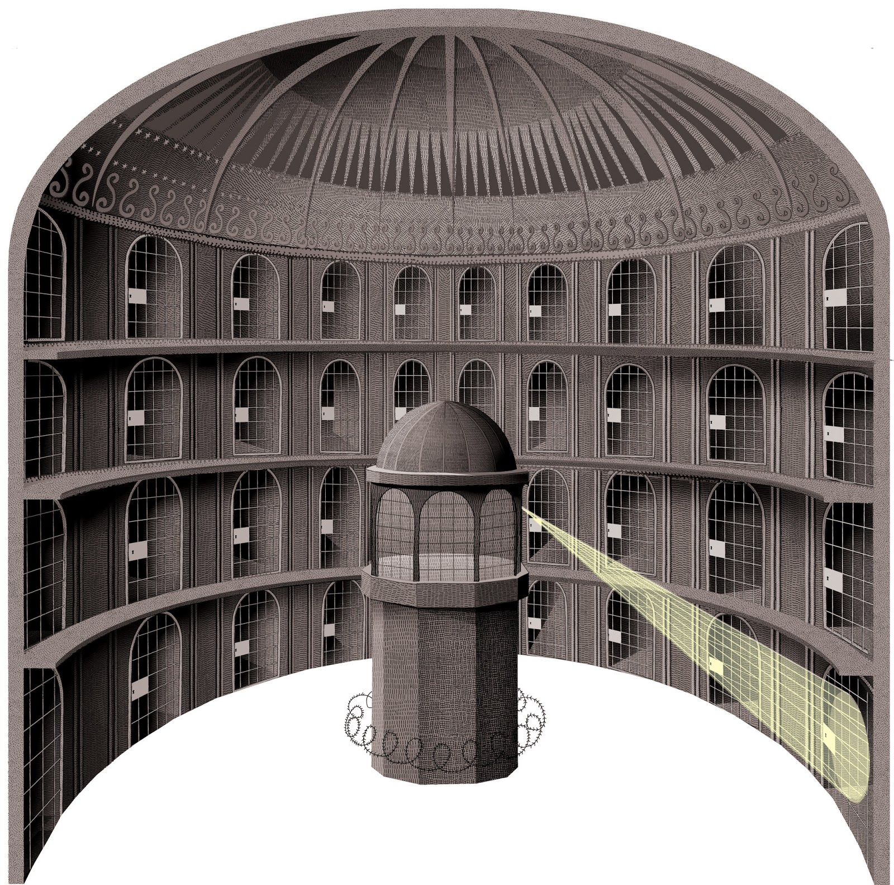
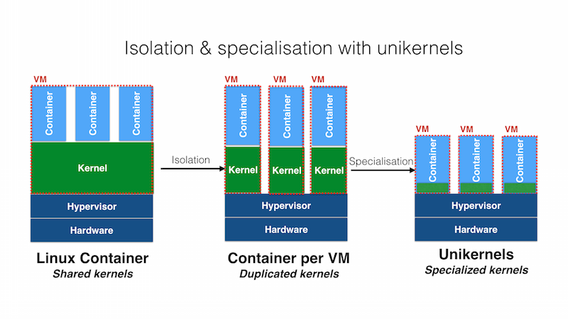
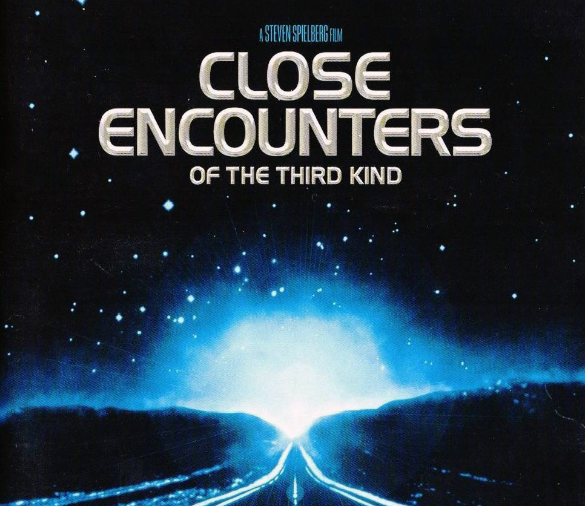

⚠️ I do not own any right on the images here displayed, if the owners is not ok with me using them, please notify me and I'll remove them. Anyway they are planned to be removed soon in a upcoming commit. ⚠️ 


# **IN490** Final Assignment V0.0.1
### Title: _Views on "RustyHermit - A Rust-based, lightweight unikernel"_
### Author: _Alessio Proietti <<alessio.proietti@stud.uniroma3.it>>_

</br>

## Virtualization 
In the long gone days of early July 1974,  Juan Perón, an Argentine army general, politician and President of Argentina died after getting into difficulty following a heart attack. In the same days, thousands of miles away of Argentina, American computer scientists were unlocking the potential of optimal usage of the then called third generation computer systems, e.g. IBM 360/67.

")

Then a foundational paper of Gerald J. Popek and Robert P. Goldberg finally  appeared on the 17th volume of _Communications of the ACM_.

Its title reads _Formal requirements for virtualizable third generation architectures_ and in the body of the text were posited a set of requirements for a computer architecture to support a legit form of system virtualization.

Virtualization is the creation of a virtual machine (by means of both hardware and software layers) that can virtualize computing resources, such as processors, memory, storage and network connectivity. Well, for a virtualization platform to qualify as such it is required to offer the following features: 

- _Fidelity_ : A program running under a virtual machine monitor (VMM) and inside a virtual machine should run (near) exactly as it would if executed on a real machine. That is to say the program could expect to be _kicked back_ as intended if it _kicks_ ( = makes) requests to its emulated environment. **VMs perfectly render computing resources**. 

- _Safety_ : Nothing inside virtual machines should escapes the grasp and the sight of the VMM, it has full secure control so it can ensure protection of data and resources. In addition, VMM prevents interference between emulation contexts. **Virtual machines play in a sandbox arranged by VMM**.

- _Efficiency_ : VMM mediation and monitoring inevitably degrade performance. A dominant fraction of execution of privileged instructions must be handled as lightly as possible with hardware or software support and not by the VMM itself. **Efficient Hypervisor (a.k.a. VMM) must delegate**. 



## VMs and Containers
Virtual machines were a great deal in a mainframe world as they has been in the early days of the World Wide Web and the commercial Internet. 

Virtualization importance in then emerging _cloud computing_ industry cannot be overstated and more recently a new paradigm walked into the stage as a promising alternative theory of workload, enabled by so called Operating System-level virtualization (Shared Kernel virtualization). 

Virtual machines are bulky and after created need configuration, installation of software and management of software updates. yes they can be replicated but they are slow to turn off and on. 
In principle they could serve as general purpose host but rapidly become high specialized. And it can reveals tricky to manage highly specialized VMs for they usually carry tons of unused, opaque and potentially flawed software. It is a flexibility and security nightmare. 


Luckily, improvements and research in computer engineering and in particular in BSD and Linux Kernel development stream continuously. 
At some point in the last two decades engineers and scientists came up with the idea of *chroot jails*. 

With jails it is now possible to multiplex _userspace_ and implement _application-level_ segregation of environments for execution. 

Proponents and adopters of this relatively new architecture of computing are trying to fullfill the vision of VMs as _generic hosts_ for _multiple_, _indipendent_ and _specialized_ userspaces called _containers_ that should be as small as a single application and easy to manage, create, start, stop, destroy and connect together. **Crucially containers are supposed to be stateless and light.** 

Being stateless they can be succintly described and arranged with simple DSLs, being light they offer little surface of attacks to bad actors.

## Unikernels
> "Bloat Is a Bigger Issue Than You Might Think." 
>  
> Russel C. Pavlicek
 
The Cloud is fat. VMs are overloaded with unpatched, obscure and insecure software and Containers themselves rely on huge kernels, on large supporting runtimes. Moreover, developers usually make every nasty trick they can to wire correctly all the resources the containers need.

The theory of Unikernels is pretty simple and straightforward. One should include into container-like objects only the minimum code the application needs to function. 

In two words they aim to be **Specialized Kernels**.



Unikernel implementations should have only one address space, only one program running inside and all low-level functions compiled directly into the unikernel-app executable. Advocates of Unikernels call them _Library Operating Systems_, in fact all boils down to a binary with app and support libraries, nothing else.

Apparently it seems like a backward evolution but it is not true. Unikernels have less attack surfaces, small footprints and they can be tailored on the precise app they hosts and, usually, they fast boot. In a world of transient microservices which pop into existence after event stochastically fired by ( _Internet of_ ) _things_,  unikernel-like technlogy is essential.
Unikernels have no shell, no alien utilities to exploit, unused drivers or password files to crack and no databases to breach.

Obviously special care is required while debugging Unikernels, anyway it can be done efficiently and correctly. There are debugging strategies in Unikernels world but it is out of the scope of this review.

## Rust
Here we are going to quote straight from wikipedia, Rust is a "multi-paradigm, general-purpose programming language designed for performance and safety, especially safe concurrency". 

Anyway the best source of knowledge for Rust is for sure its home on the web, https://www.rust-lang.org/. 

 

Rust comes in various "flavours": nightly, beta, stable. One should install the _Rust Toolchain_ with the official installer https://rustup.rs/ and that's because one expects to have the possibility to enrich the programming environment easily with additional packages and "components" in order to perform very peculiar compilation jobs, especially when working on low-level programming tasks (e.g. write bare-metal applications and kernels).

It's better to rely on a tested and reviewed Software Manager for moving smoothly from one programming environment to another.  

## A "Close Encounter" with RustyHermit 

 

RustyHermit (https://github.com/hermitcore/rusty-hermit) is apparently an attempt to port and modernize _HermitCore's C_  basecode (http://hermitcore.org/) to _Rust_. It is developed by a small internet community lead by researchers at at RWTH-Aachen. The project aims at establish a robust Unikernel candidate for HPC workloads.

RustyHermit has a couple of companion projects, one is _uhyve_ (https://github.com/hermitcore/uhyve), that is a custom hypervisor which requires both KVM and a system supporting virtualization and is tailored for RustyHermit-based unikernels, the other is a custom light bootloader (https://github.com/hermitcore/rusty-loader) which is needed when RustyHermit-based unikernels are run with QEMU. 

The following amounts to a mere description of the _author's personal experience_ with this object.

There has been a first round of exploration of RustyHermit potential following step by step the official documentation of the project. Unfortunately fetching RustyHermit's crate from Cargo Repository and using it as a dependency in a blank project resulted in repeatedly unsuccesful compilation attempts, each iteration of the build project introduces new displayed errors and quite unclear messages from the prompts. There have been ebbs and flow of succesful compilations with then unusable "hello world" unikernels or inexplicably failed compilations.

History of this unfruitful quest is documented by the author's (@alessio-proietti) tickets on the official Issue Tracker of the project (https://github.com/hermitcore/rusty-hermit/issues).

Later on, the second phase of the research started with the author initially cloning the original and complete repository of RustyHermit and then compiling the application code of the demo shipped with the repo. This choice was forced after noting that configuration code and building options was present in the repository and the demo apps in fact relied heavily on this fine-tuned _corpus_ of code to work. 

_If it works, don't break it._

---
\ STUB  STUB  STUB  TODO \  

One example app, among those provided as demos, seems to be really interesting. This app is simple HTTP server...

... 

it has been LAUNCHED with...
```
$ qemu-system-x86_64 -cpu qemu64,apic,fsgsbase,rdtscp,xsave,xsaveopt,fxsr \
        -enable-kvm -display none -smp 1 -m 1G -serial stdio \
        -kernel path_to_loader/rusty-loader \
        -initrd path_to_app/app \
        -netdev tap,id=net0,ifname=tap10,script=no,downscript=no,vhost=on \
        -device virtio-net-pci,netdev=net0,disable-legacy=on
``` 

errors:
```
[LOADER] Unsupported relocation type 6
[LOADER] BootInfo located at 0x11f188
[LOADER] Use stack address 0xa000
[LOADER] Jumping to HermitCore Application Entry Point at 0x101cb80
```


\ STUB TODO \  

---


## Conclusions

RustyHermit is definitely young, quite unstable for production yet it is promising and a Unikernel working PoC really would be needed in the HPC space.

Unikernels are not a _Panacea_, nothing is. They are not bound to completely outperform Containers and the best outcome of Unikernels research is, perhaps, a contamination and a (eventually) merge of Containers and Unikernels best intuitions: _Less is more_.


## References
- G. J. Popek and R. P. Goldberg. Formal Requirements for virtualizable third generations architectures. _Comms. ACM_, 17(7):412-421, July 1974.
- Pavlicek, Russell. Unikernels. _O'Reilly Media, Inc._, 2016.